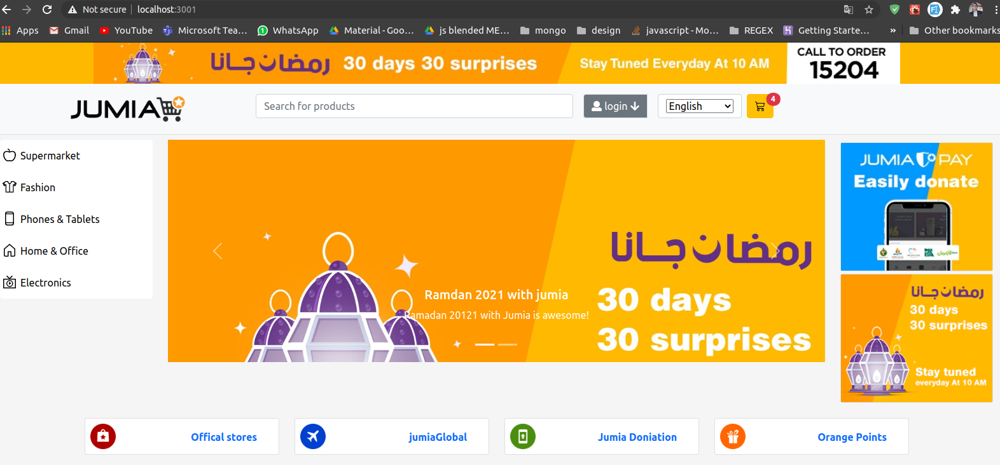
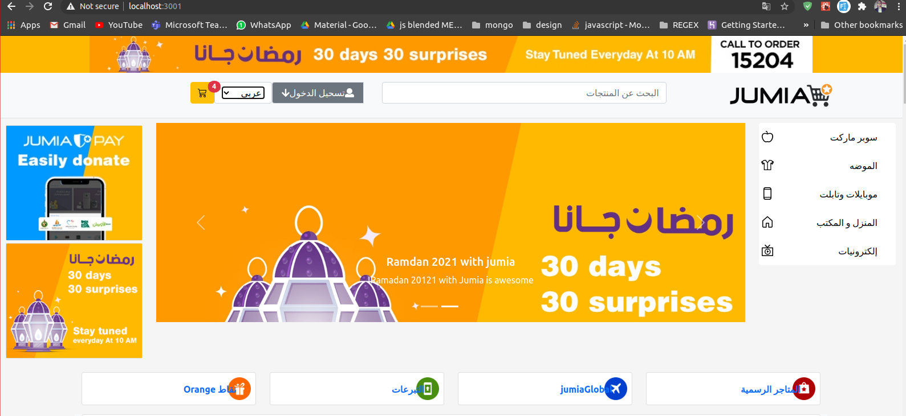
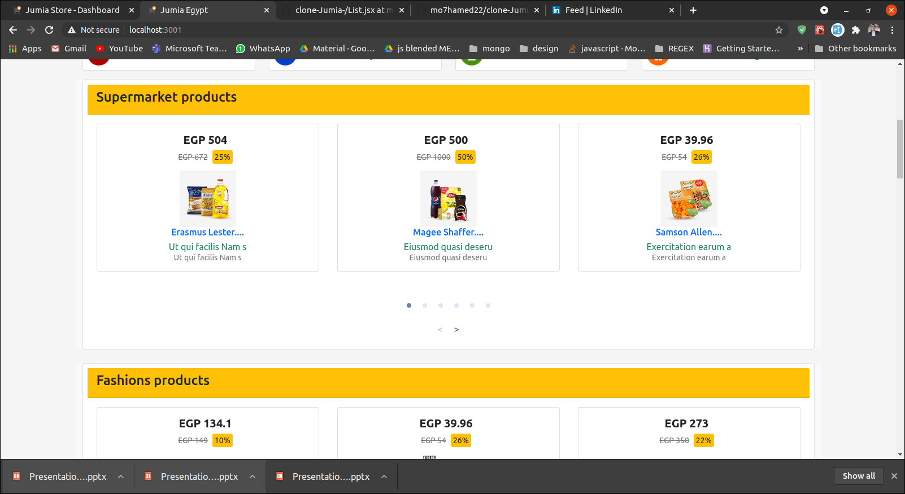
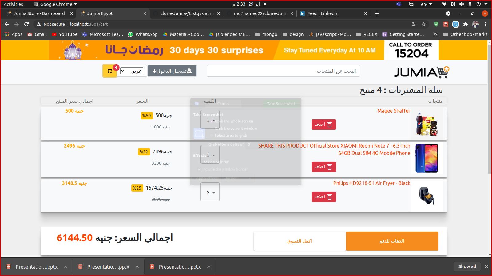
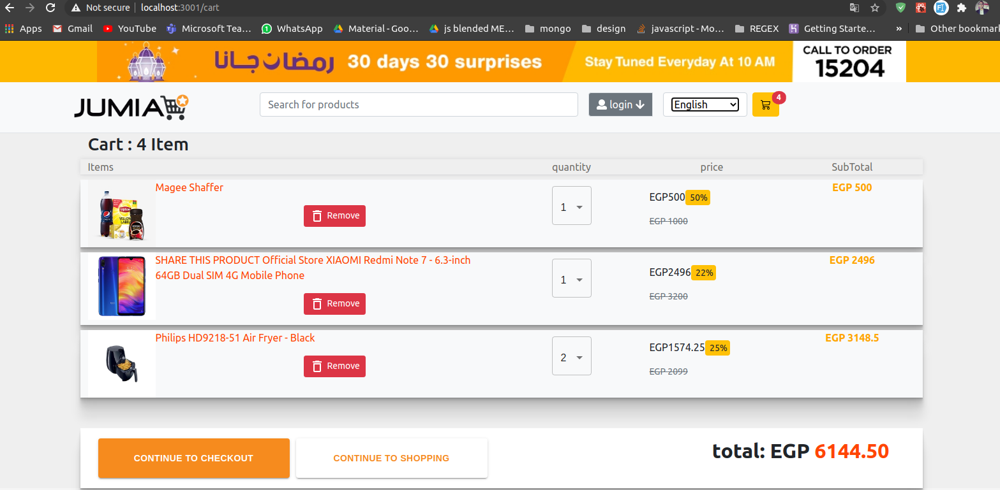
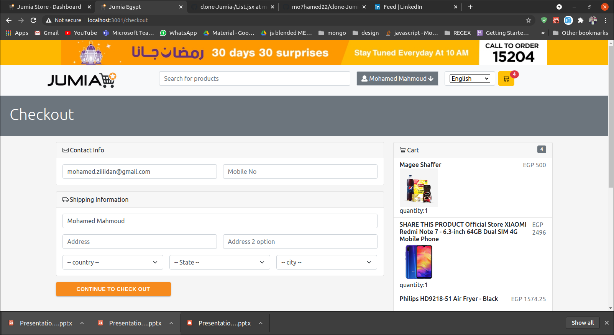
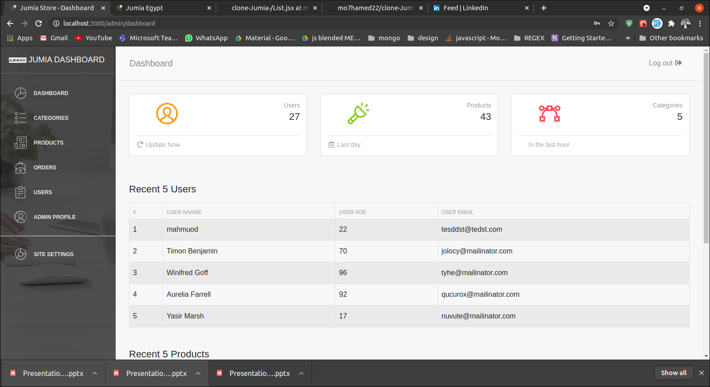
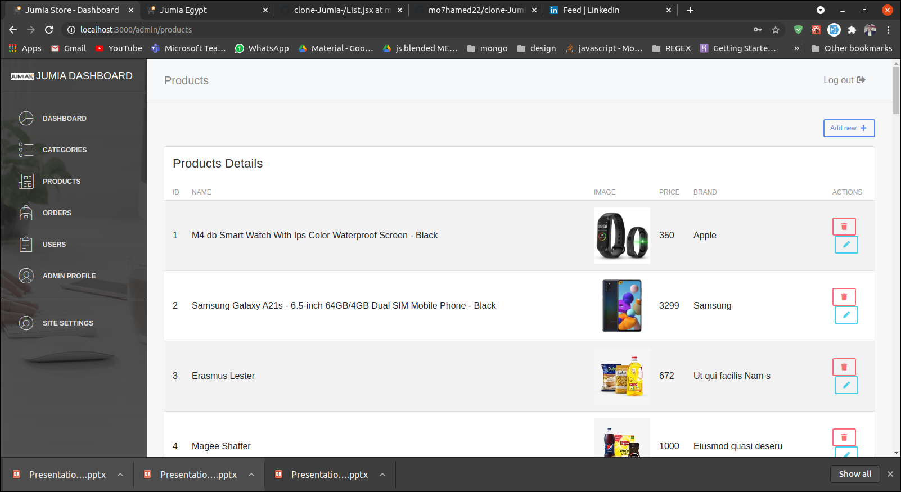

# clone-Jumia-
Graduation Project From ITI MEARN Stack ,This is Web Site E-commerce Application 
<h3>Home Page <h3>

  
    

  <h3>Cart <h3>

  
    <h3>Shipment <h3>

  <h3>Dashboard <h3>

    
    
    Tools and technologies used 
 <h1>  User Interface</h1>
<li>HTML5 & CSS</li>
<li>Bootstrap</li>
<li>JavaScript</li>
<li>React Js (Hooks , Redux )</li>
<h1>Backend </h1>
<li>Node.js</li>
<li>MongoDB</li>
<li>Web API</li>
<li>JWT</li>
<h1>Admin dashbord</h1>
<li>HTML5 & CSS3</li>
<li>React </li>
<li>Javascript</li>

  
  

